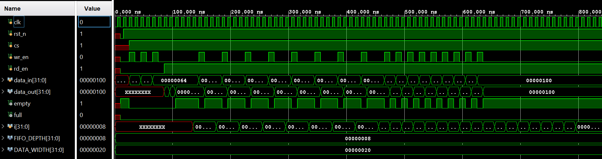
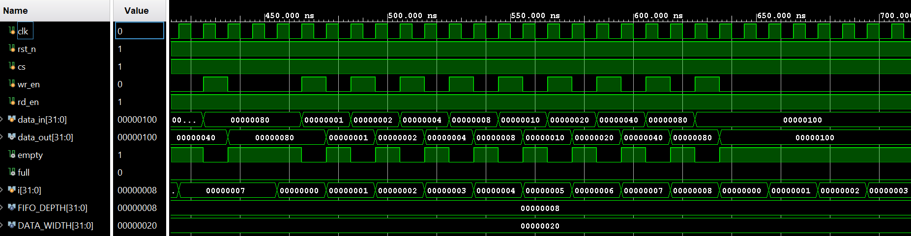
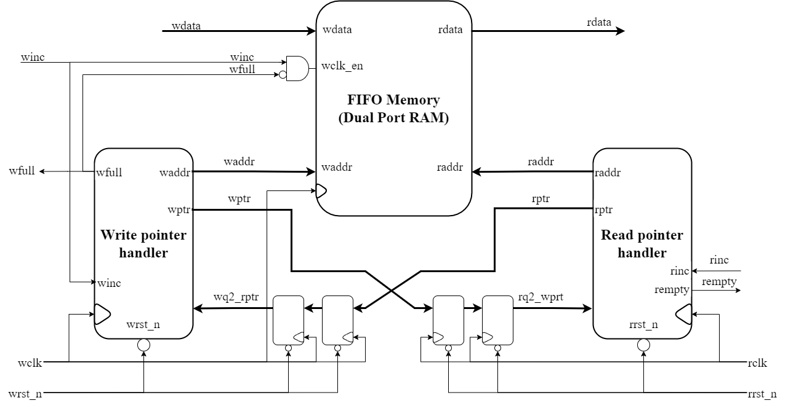

# FIFO Design Repository

## Table of Contents

- [Introduction](#introduction)
- [Synchronous FIFO Design](#synchronous-fifo-design)
  - [Overview](#overview)
  - [Testbench Case Implementation](#testbench-case-implementation)
  - [Results](#results)
  - [Conclusion](#conclusion)
- [Asynchronous FIFO Design](#asynchronous-fifo-design)
  - [Design Space Exploration and Design Strategies](#design-space-exploration-and-design-strategies)
  - [Read and Write Operations](#read-and-write-operations)
  - [Full, Empty, and Wrapping Condition](#full-empty-and-wrapping-condition)
  - [Gray Code Counter](#gray-code-counter)
  - [Signals Definition](#signals-definition)
  - [Dividing System Into Modules](#dividing-system-into-modules)
  - [Testbench Case Implementation](#testbench-case-implementation)
  - [Waveforms](#waveforms)
  - [Results](#results)
  - [Conclusion](#conclusion)
  - [References](#references)

## Introduction

FIFO stands for "First-In, First-Out." It is a type of data structure or buffer in which the first data element added (the "first in") is the first one to be removed (the "first out"). This structure is commonly used in scenarios where order of operations is important.

## Synchronous FIFO Design

This repository contains Verilog code for a synchronous FIFO.

### Design Space Exploration and Design Strategies

The block diagram of the synchronous FIFO implemented in this repository is given below. In Synchronous FIFO, data read and write operations use the same clock frequency. Usually, they are used with high clock frequency to support high-speed systems.

### Read and Write Operations

In a synchronous FIFO, the read and write operations are managed by the same clock domain. The write pointer always points to the next word to be written. On a FIFO-write operation, the memory location pointed to by the write pointer is written, and then the write pointer is incremented to point to the next location to be written. Similarly, the read pointer always points to the current FIFO word to be read. On reset, both pointers are set to zero. When the first data word is written to the FIFO, the write pointer increments, the empty flag is cleared, and the read pointer, which is still addressing the contents of the first FIFO memory word, immediately drives that first valid word onto the FIFO data output port to be read by the receiver logic.

### Full, Empty, and Wrapping Condition

The conditions for the FIFO to be full or empty are as follows:

- **Empty Condition**: The FIFO is empty when the read and write pointers are both equal.
- **Full Condition**: The FIFO is full when the write pointer has wrapped around and caught up to the read pointer.

To distinguish between the full and empty conditions when the pointers are equal, an extra bit is added to each pointer. This extra bit helps in identifying whether the pointers have wrapped around.

### Signals Definition

Following is the list of signals used in the design with their definitions:

- `clk`: Clock signal.
- `rst_n`: Active low reset signal.
- `cs`: Chip select signal.
- `wr_en`: Write enable signal.
- `rd_en`: Read enable signal.
- `data_in`: Input data bits.
- `data_out`: Output data bits.
- `empty`: FIFO empty flag.
- `full`: FIFO full flag.
- `wr_ptr`: Write pointer.
- `rd_ptr`: Read pointer.

### Dividing System Into Modules

1. **`sync_fifo.v`**: The top-level wrapper module includes all logic for the synchronous FIFO.

### Testbench Case Implementation

The testbench for the synchronous FIFO includes three test cases:

1. Write data and read it back.
2. Write and read data alternately in each clock cycle.
3. Write the entire FIFO and then read all the data back.

### Waveforms

Waveforms for the test cases are provided in the repository.

### Results

The synchronous FIFO design was tested using a testbench. Key results include:

- Correct data storage and retrieval.
- Accurate full and empty condition handling.

### Conclusion

The synchronous FIFO design demonstrates reliable data storage and retrieval within a single clock domain. The design ensures proper handling of full and empty conditions, making it suitable for applications requiring efficient data buffering.

## Asynchronous FIFO Design

This repository contains Verilog code for an asynchronous FIFO.

### Design Space Exploration and Design Strategies

The block diagram of the asynchronous FIFO implemented in this repository is given below. Thin lines represent single-bit signals, whereas thick lines represent multi-bit signals.

### Read and Write Operations

In an asynchronous FIFO, the read and write operations are managed by separate clock domains. The write pointer always points to the next word to be written. On a FIFO-write operation, the memory location pointed to by the write pointer is written, and then the write pointer is incremented to point to the next location to be written. Similarly, the read pointer always points to the current FIFO word to be read. On reset, both pointers are set to zero. When the first data word is written to the FIFO, the write pointer increments, the empty flag is cleared, and the read pointer, which is still addressing the contents of the first FIFO memory word, immediately drives that first valid word onto the FIFO data output port to be read by the receiver logic.

### Full, Empty, and Wrapping Condition

The conditions for the FIFO to be full or empty are as follows:

- **Empty Condition**: The FIFO is empty when the read and write pointers are both equal.
- **Full Condition**: The FIFO is full when the write pointer has wrapped around and caught up to the read pointer.

To distinguish between the full and empty conditions when the pointers are equal, an extra bit is added to each pointer. This extra bit helps in identifying whether the pointers have wrapped around.

### Gray Code Counter

Gray code counters are used in FIFO design because they only allow one bit to change for each clock transition. This characteristic eliminates the problem associated with trying to synchronize multiple changing signals on the same clock edge, which is crucial for reliable operation in asynchronous systems.

### Signals Definition

Following is the list of signals used in the design with their definitions:

- `wclk`: Write clock signal.
- `rclk`: Read clock signal.
- `wdata`: Write data bits.
- `rdata`: Read data bits.
- `wclk_en`: Write clock enable.
- `wptr`: Write pointer (Gray).
- `rptr`: Read pointer (Gray).
- `winc`: Write pointer increment.
- `rinc`: Read pointer increment.
- `waddr`: Binary write pointer address.
- `raddr`: Binary read pointer address.
- `wfull`: FIFO full flag.
- `rempty`: FIFO empty flag.
- `wrst_n`: Active low asynchronous reset for the write pointer handler.
- `rrst_n`: Active low asynchronous reset for the read pointer handler.

### Dividing System Into Modules

The asynchronous FIFO is divided into the following modules:

1. **`FIFO.v`**: The top-level wrapper module includes all clock domains and instantiates all other FIFO modules.
2. **`FIFO_memory.v`**: Contains the buffer or memory of the FIFO.
3. **`two_ff_sync.v`**: A 2-flop synchronizer for clock domain crossing.
4. **`rptr_empty.v`**: Implements the read pointer handler and generates the FIFO empty signal.
5. **`wptr_full.v`**: Implements the write pointer handler and generates the FIFO full signal.
6. **`synchronizer.v`**: Implements a 2 flop synchronizer to reduce CDC and metastability conditions.

### Testbench Case Implementation

The testbench for the asynchronous FIFO includes three test cases:

1. Write data and read it back.
2. Write data to make the FIFO full and try to write more data.
3. Read data from an empty FIFO and try to read more data.

### Waveforms

Waveforms for the test cases are provided in the repository.

### Results

The asynchronous FIFO design was tested using a testbench. Key results include:

- Correct data storage and retrieval.
- Accurate full and empty condition handling.

### Conclusion

The asynchronous FIFO design demonstrates reliable data storage and retrieval between asynchronous clock domains. The use of gray code counters ensures proper synchronization.

### References

- Sunburst Design: Simulation and Synthesis Techniques for Asynchronous FIFO Design
- VLSI Verify Blog - Synchronous FIFO
- VLSI Verify Blog - Asynchronous FIFO
